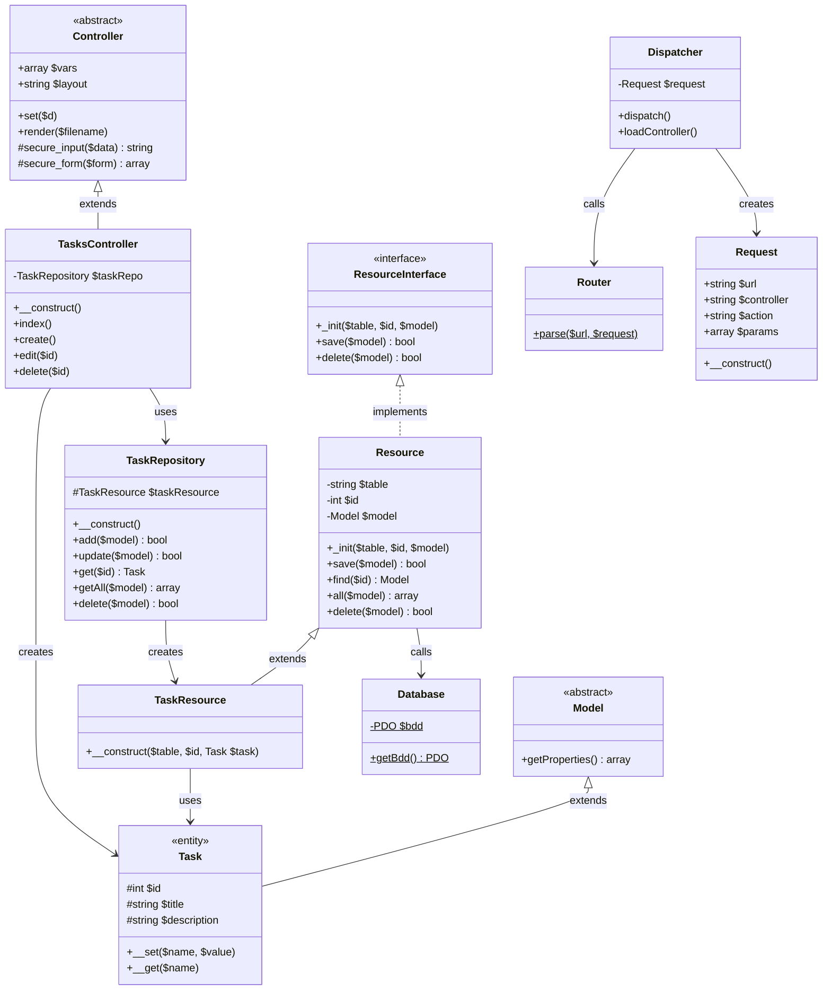

# MVC Framework - Mô Hình Lớp Trừu Tượng (UML)

## Sơ Đồ Lớp



---

## Đặc Tả Lớp Trừu Tượng

### 1. Model (Lớp Cơ Sở Trừu Tượng)

```
┌─────────────────────────────────────────┐
│           «abstract»                    │
│              Model                      │
├─────────────────────────────────────────┤
│  +getProperties(): array                │
└─────────────────────────────────────────┘
        △
        │ kế thừa
┌───────┴─────────────────────────────────┐
│             «entity»                    │
│              Task                       │
├─────────────────────────────────────────┤
│  #id: int                               │
│  #title: string                         │
│  #description: string                   │
├─────────────────────────────────────────┤
│  +__set($name, $value)                  │
│  +__get($name)                          │
└─────────────────────────────────────────┘
```

| Khía Cạnh | Chi Tiết |
|-----------|----------|
| **Mục Đích** | Lớp cơ sở cho tất cả các thực thể domain |
| **Phương Thức Chính** | `getProperties()` - Phản ánh trạng thái đối tượng |
| **Mẫu Thiết Kế** | Template Method (cung cấp cơ sở, lớp con mở rộng) |
| **Quy Trình Truy Cập** | Thuộc tính `protected` để kế thừa |

---

### 2. ResourceInterface (Hợp Đồng)

```
┌─────────────────────────────────────────┐
│         «interface»                     │
│       ResourceInterface                 │
├─────────────────────────────────────────┤
│  +_init($table, $id, $model)            │
│  +save($model): bool                    │
│  +delete($model): bool                  │
└─────────────────────────────────────────┘
        △
        │ hiện thực hóa
┌───────┴─────────────────────────────────┐
│              Resource                   │
├─────────────────────────────────────────┤
│  -table: string                         │
│  -id: int                               │
│  -model: Model                          │
├─────────────────────────────────────────┤
│  +_init($table, $id, $model)            │
│  +save($model): bool                    │
│  +find($id): Model                      │
│  +all($model): array                    │
│  +delete($model): bool                  │
└─────────────────────────────────────────┘
        △
        │ kế thừa
┌───────┴─────────────────────────────────┐
│          TaskResource                   │
├─────────────────────────────────────────┤
│  +__construct($table, $id, Task)        │
└─────────────────────────────────────────┘
```

| Khía Cạnh | Chi Tiết |
|-----------|----------|
| **Mẫu Thiết Kế** | Strategy Pattern (interface định nghĩa thuật toán) |
| **Hợp Đồng** | `_init`, `save`, `delete` |
| **Mở Rộng** | `find`, `all` được thêm trong `Resource` cụ thể |
| **Lợi Ích** | Lỏng lẻo, có thể kiểm thử |

---

### 3. Controller (Lớp Cơ Sở Trừu Tượng)

```
┌─────────────────────────────────────────┐
│           «abstract»                    │
│           Controller                   │
├─────────────────────────────────────────┤
│  +vars: array = []                      │
│  +layout: string = "default"            │
├─────────────────────────────────────────┤
│  +set($d)                               │
│  +render($filename)                     │
│  #secure_input($data): string           │
│  #secure_form($form): array             │
└─────────────────────────────────────────┘
        △
        │ kế thừa
┌───────┴─────────────────────────────────┐
│        TasksController                  │
├─────────────────────────────────────────┤
│  -taskRepo: TaskRepository              │
├─────────────────────────────────────────┤
│  +__construct()                         │
│  +index()                               │
│  +create()                              │
│  +edit($id)                             │
│  +delete($id)                           │
└─────────────────────────────────────────┘
```

| Khía Cạnh | Chi Tiết |
|-----------|----------|
| **Mục Đích** | Cơ sở cho tất cả các controller |
| **Mẫu Chính** | Template Method (`render()` tự động phân giải view) |
| **Bảo Mật** | `#secure_input` - Phòng chống XSS |
| **Bảo Mật** | `#secure_form` | Làm sạch hàng loạt |

---

## So Sánh Interface vs Lớp Trừu Tượng

| Đặc Điểm | ResourceInterface | Controller (Trừu Tượng) | Model (Trừu Tượng) |
|-----------|-------------------|------------------------|---------------------|
| **Loại** | Interface | Lớp Trừu Tượng | Lớp Trừu Tượng |
| **Mục Đích** | Định nghĩa hợp đồng | Cung cấp hiện thực cơ sở | Cung cấp hiện thực cơ sở |
| **Thuộc Tính** | Không | Có | Không |
| **Phương Thức** | Chỉ chữ ký | Hiện thực đầy đủ | Hiện thực đầy đủ |
| **Đa Kế Thừa** | Có thể hiện thực hóa nhiều | Chỉ kế thừa một | Chỉ kế thừa một |
| **Sử Dụng** | Resource, TaskResource | TasksController | Task |

---

## Tổng Hợp Mẫu Thiết Kế

| Mẫu Thiết Kế | Nơi Sử Dụng | Mục Đích |
|---------------|--------------|----------|
| **Repository** | TaskRepository | Trừu tượng hóa truy cập dữ liệu |
| **Active Record** | Task (qua Resource) | Ánh xạ đối tượng-quan hệ |
| **Strategy** | ResourceInterface | Đóng gói thuật toán |
| **Singleton** | Database | Instance kết nối duy nhất |
| **Template Method** | Controller::render() | Thuật toán render view |
| **Factory** | Dispatcher::loadController() | Khởi tạo lớp động |

---

## Chuỗi Kế Thừa

```
ResourceInterface
        │
        ▼
    Resource
        │
        ▼
  TaskResource
        │
        ▼ (tạo)
  TaskRepository ─────────────────────┐
                                      │
                                      ▼
Model ──► Task    Controller ──► TasksController
                    │                    │
                    │                    ▼
                    │              TaskRepository
                    │
                    ▼
              Dispatcher
                    │
                    ▼
               Request ◄── Router
```

---

## Ma Trận Quy Trình Truy Cập

| Lớp | Thuộc Tính | Phương Thức | Mức Truy Cập |
|------|------------|-------------|--------------|
| **Model** | - | `getProperties()` | public |
| **Task** | `$id, $title, $description` | `__set, __get` | protected |
| **ResourceInterface** | - | `_init, save, delete` | public |
| **Resource** | `$table, $id, $model` | tất cả | public |
| **TaskResource** | (kế thừa) | `__construct` | public |
| **TaskRepository** | `$taskResource` | CRUD methods | protected |
| **Controller** | `$vars, $layout` | render, set, secure | public |
| **TasksController** | `$taskRepo` | CRUD actions | private |

---

## Trách Nhiệm Lớp Trừu Tượng

| Lớp Trừu Tượng | Trách Nhiệm | Lớp Con |
|-----------------|-------------|---------|
| **Model** | Quản lý trạng thái thực thể | Task |
| **ResourceInterface** | Hợp đồng truy cập dữ liệu | Resource |
| **Controller** | Xử lý phản hồi HTTP | TasksController |

---

## Điểm Tiêm Phụ Thuộc

```
TasksController
    ├── TaskRepository (tiêm trong __construct)
    │       └── TaskResource (tiêm trong __construct)
    │               └── Task (tiêm trong __construct)
    └── Task (tạo cho mỗi action)
```

| Tiêm | Phương Thức | Loại |
|------|-------------|------|
| TaskRepository → TaskResource | Constructor | Tạo |
| TaskResource → Task | Constructor | Tạo |
| TasksController → TaskRepository | Constructor | Tạo |
