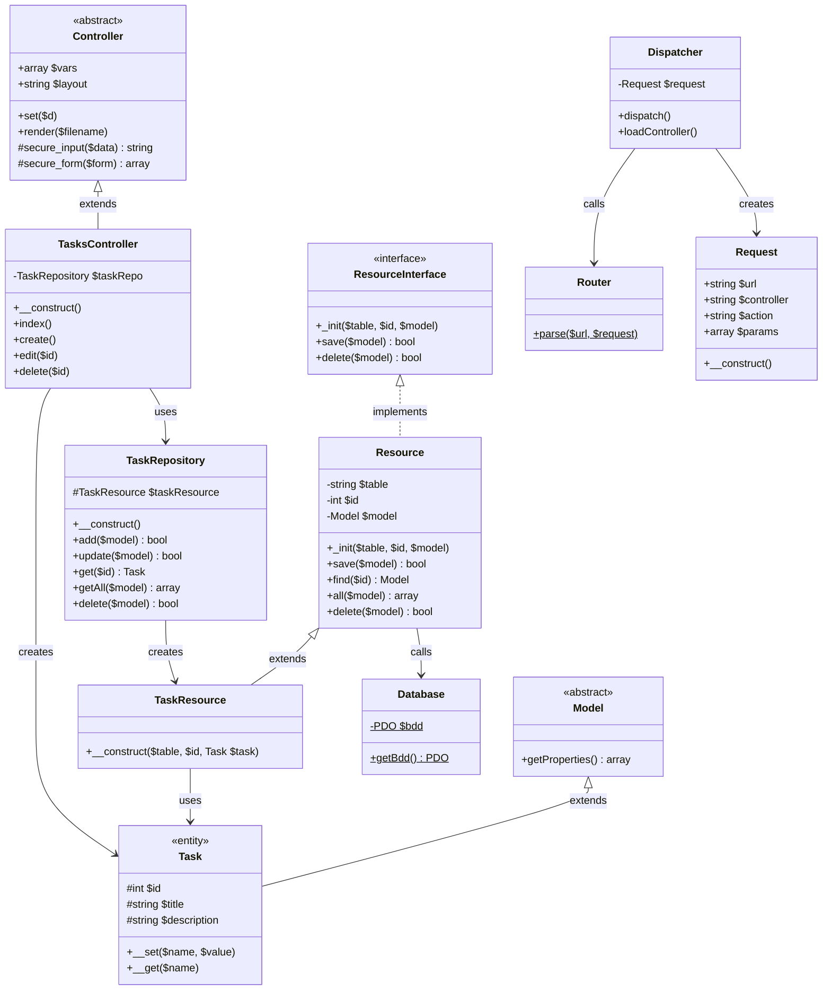

# MVC Framework - Abstract Class Model (UML)

## Class Diagram



---

## Abstract Class Specifications

### 1. Model (Abstract Base)

```
┌─────────────────────────────────────────┐
│           «abstract»                    │
│              Model                      │
├─────────────────────────────────────────┤
│  +getProperties(): array                │
└─────────────────────────────────────────┘
        △
        │ extends
┌───────┴─────────────────────────────────┐
│             «entity»                    │
│              Task                       │
├─────────────────────────────────────────┤
│  #id: int                               │
│  #title: string                         │
│  #description: string                   │
├─────────────────────────────────────────┤
│  +__set($name, $value)                  │
│  +__get($name)                          │
└─────────────────────────────────────────┘
```

| Aspect | Details |
|--------|---------|
| **Purpose** | Base class for all domain entities |
| **Key Method** | `getProperties()` - Reflects object state |
| **Pattern** | Template Method (provides base, children extend) |
| **Visibility** | `protected` properties for inheritance |

---

### 2. ResourceInterface (Contract)

```
┌─────────────────────────────────────────┐
│         «interface»                     │
│       ResourceInterface                 │
├─────────────────────────────────────────┤
│  +_init($table, $id, $model)            │
│  +save($model): bool                    │
│  +delete($model): bool                  │
└─────────────────────────────────────────┘
        △
        │ implements
┌───────┴─────────────────────────────────┐
│              Resource                   │
├─────────────────────────────────────────┤
│  -table: string                         │
│  -id: int                               │
│  -model: Model                          │
├─────────────────────────────────────────┤
│  +_init($table, $id, $model)            │
│  +save($model): bool                    │
│  +find($id): Model                      │
│  +all($model): array                    │
│  +delete($model): bool                  │
└─────────────────────────────────────────┘
        △
        │ extends
┌───────┴─────────────────────────────────┐
│          TaskResource                   │
├─────────────────────────────────────────┤
│  +__construct($table, $id, Task)        │
└─────────────────────────────────────────┘
```

| Aspect | Details |
|--------|---------|
| **Pattern** | Strategy Pattern (interface defines algorithm) |
| **Contract** | `_init`, `save`, `delete` |
| **Extension** | `find`, `all` added in concrete `Resource` |
| **Benefit** | Loose coupling, testability |

---

### 3. Controller (Abstract Base)

```
┌─────────────────────────────────────────┐
│           «abstract»                    │
│           Controller                   │
├─────────────────────────────────────────┤
│  +vars: array = []                      │
│  +layout: string = "default"            │
├─────────────────────────────────────────┤
│  +set($d)                               │
│  +render($filename)                     │
│  #secure_input($data): string           │
│  #secure_form($form): array             │
└─────────────────────────────────────────┘
        △
        │ extends
┌───────┴─────────────────────────────────┐
│        TasksController                  │
├─────────────────────────────────────────┤
│  -taskRepo: TaskRepository              │
├─────────────────────────────────────────┤
│  +__construct()                         │
│  +index()                               │
│  +create()                              │
│  +edit($id)                             │
│  +delete($id)                           │
└─────────────────────────────────────────┘
```

| Aspect | Details |
|--------|---------|
| **Purpose** | Base for all controllers |
| **Key Pattern** | Template Method (`render()` auto-resolves views) |
| **Security** | `#secure_input` - XSS prevention |
| **Security** | `#secure_form` - Batch sanitization |

---

## Interface vs Abstract Class Comparison

| Feature | ResourceInterface | Controller (Abstract) | Model (Abstract) |
|---------|-------------------|----------------------|------------------|
| **Type** | Interface | Abstract Class | Abstract Class |
| **Purpose** | Define contract | Provide base impl | Provide base impl |
| **Properties** | None | Yes | None |
| **Methods** | Signature only | Full implementation | Full implementation |
| **Multiple** | Can implement many | Can extend one | Can extend one |
| **Usage** | Resource, TaskResource | TasksController | Task |

---

## Design Patterns Summary

| Pattern | Where Used | Purpose |
|---------|------------|---------|
| **Repository** | TaskRepository | Abstracts data access |
| **Active Record** | Task (via Resource) | Object-relational mapping |
| **Strategy** | ResourceInterface | Algorithm encapsulation |
| **Singleton** | Database | Single connection instance |
| **Template Method** | Controller::render() | View rendering algorithm |
| **Factory** | Dispatcher::loadController() | Dynamic class instantiation |

---

## Inheritance Chain

```
ResourceInterface
        │
        ▼
    Resource
        │
        ▼
  TaskResource
        │
        ▼ (creates)
  TaskRepository ─────────────────────┐
                                      │
                                      ▼
Model ──► Task    Controller ──► TasksController
                    │                    │
                    │                    ▼
                    │              TaskRepository
                    │
                    ▼
              Dispatcher
                    │
                    ▼
               Request ◄── Router
```

---

## Visibility Matrix

| Class | Properties | Methods | Access Level |
|-------|------------|---------|--------------|
| **Model** | - | `getProperties()` | public |
| **Task** | `$id, $title, $description` | `__set, __get` | protected |
| **ResourceInterface** | - | `_init, save, delete` | public |
| **Resource** | `$table, $id, $model` | all | public |
| **TaskResource** | (inherited) | `__construct` | public |
| **TaskRepository** | `$taskResource` | CRUD methods | protected |
| **Controller** | `$vars, $layout` | render, set, secure | public |
| **TasksController** | `$taskRepo` | CRUD actions | private |

---

## Abstract Class Responsibilities

| Abstract Class | Responsibility | Children |
|----------------|----------------|----------|
| **Model** | Entity state management | Task |
| **ResourceInterface** | Data access contract | Resource |
| **Controller** | HTTP response handling | TasksController |

---

## Dependency Injection Points

```
TasksController
    ├── TaskRepository (injected in __construct)
    │       └── TaskResource (injected in __construct)
    │               └── Task (injected in __construct)
    └── Task (created per action)
```

| Injection | Method | Type |
|-----------|--------|------|
| TaskRepository → TaskResource | Constructor | Creation |
| TaskResource → Task | Constructor | Creation |
| TasksController → TaskRepository | Constructor | Creation |
